# Kanken 出荷計画シミュレーションシステム — システム仕様・引き継ぎ書

本ドキュメントは、Kanken（品番23510）出荷計画シミュレーションおよび可視化ダッシュボードシステムの内部構造、データ結合仕様、および計算アルゴリズムをまとめた開発者・管理者向けの引き継ぎ用ドキュメントです。

---

## 1. システム概要とアーキテクチャ

本システムは、基幹システムからエクスポートした「在庫」と「販売実績」を処理し、Excel（v6）サマリーシートを更新するとともに、Webダッシュボード（HTML形式）に結果を出力する3段階のPythonパイプラインで構築されています。

### 全体アーキテクチャ

```mermaid
graph TD
    A[在庫一覧.csv] -->|読込| G[build_summary.py]
    B[2026実績.csv] -->|読込| G
    C[分配店舗向け.xlsx] -->|master / 2026売上| G
    D[Kanken23510_2026年版_v6.xlsx] -->|F列:FW入荷 / 上書き| G
    
    G -->|D, E, H, I, L列上書き| D
    
    D -->|読込| H[backend_calc.py]
    B -->|MTH / 拠点名 読込| H
    C -->|読込| H
    
    H -->|データ結合 & 計算| I[dashboard_data.js]
    H -->|CSV形式出力| J[検証用_統合データ.csv]
    
    I -->|データ注入| K[update_dashboard.py]
    K -->|HTML生成| L[Kanken_Dashboard_最新版.html]
```

### 構成ファイルと役割

| ファイル名 | 区分 | 役割・説明 |
|---|---|---|
| `build_summary.py` | Python | **Step 1:** 在庫/実績CSVと分配店舗マスタを読み込み、Excel（v6.xlsx）の「全体サマリー」シートのKPI列（D, E, H, I, L）と合計行を再構築・上書きします。 |
| `backend_calc.py` | Python | **Step 2:** 更新されたExcel、実績CSV、店舗マスタを結合し、ローリングフォーキャストの再計算、店舗別ベースシェアの計算を行い、ダッシュボード用のデータJS（`dashboard_data.js`）および検証用CSVを出力します。 |
| `update_dashboard.py` | Python | **Step 3:** `dashboard_data.js` をテンプレートHTMLに注入し、動的なWebダッシュボード `Kanken_Dashboard_最新版.html` を出力します。 |
| `verify_dashboard.py` | Python | **検証用:** Excel（v6）の値と、最終生成されたダッシュボードHTMLの表示用値（KPI合計値およびカラー別分類）が完全に一致するかどうかを自動検証します。 |
| `データ更新を実行する.bat` | BAT | 上記3プログラム（build_summary → backend_calc → update_dashboard）を順次実行し、自動でブラウザを起動する運用バッチです。 |

---

## 2. データ結合・マスタ突合仕様

本システムは、Kanken（品番23510）のみを対象としたフィルタリングおよびマッピングを行うため、以下のマスタ突合ルールを用いています。

### マスタ・CSV間の結合キー対応

| ソースファイル | 対象列名 | データ形式例 | マッチング方法 |
|---|---|---|---|
| **分配店舗向け.xlsx** (`master`シート) | `品番` | `23510021-312X` `23510031X` | **基準キー**として使用（品番ごとにカラー名が1対1で対応） |
| **在庫一覧.csv** | `商品コード` | `23510021X` `23510228X` | `master`シートの`品番`と前方一致／直接結合。 |
| **2026実績.csv** (生データ) | `3rd Item No.` | `23510021-312X` `23510312X` | `master`シートの`品番`と完全一致で結合（Kanken以外の他品番はマッピング結果がNullになり自動除外される）。 |

### 在庫集計の分類・除外ルール (`build_summary.py`)

* **集計対象外の拠点 (除外)**
  * `New Way-B`, `New Way-C`, `New Way-G` は、不良在庫やテスト用拠点のため集計から明示的に除外されます。
* **倉庫WH (D列) としてカウントする拠点**
  * `バルク`, `New Way-A`
* **店舗在庫 (E列) としてカウントする拠点**
  * 上記の「集計対象外」および「倉庫WH」**以外のすべての拠点**（実店舗＋ZOZO等のECを含む）。

---

## 3. 主要な計算アルゴリズム

### ① 総供給の計算式 (H列)
以前は古い値がハードコードされていましたが、店舗在庫を含むルールに統一されました。
$$\text{総供給 (H列)} = \text{倉庫WH (D列)} + \text{店舗在庫 (E列)} + \text{FW入荷予定 (F列)}$$
* ※ `FW入荷予定` (F列) は将来の入荷計画固定値であり、Excelからそのまま読み取られます。

### ② 需要予測 (I列) ─ ローリングフォーキャスト
実績データから年間予測を立て、残りの下半期（6〜12月）に必要な需要を算出します。

* **月別累積進捗率 (2024年季節指数に基づく)**
  * 各月の進捗率 $P_m$ は以下のように固定定義されています。

| 1月 | 2月 | 3月 | 4月 | 5月 | 6月 | 7月 | 8月 | 9月 | 10月 | 11月 | 12月 |
|---|---|---|---|---|---|---|---|---|---|---|---|
| 4.37% | 10.50% | 19.70% | 30.90% | 39.68% | 49.21% | 59.68% | 70.67% | 79.03% | 86.77% | 93.60% | 100.0% |

* **年間売上予測の計算**
  $$\text{年間売上予測} = \frac{\text{累計実績（1月〜当月）}}{P_{\text{実績月数}}}$$
  * ※実績月数は、実績CSVに売上データ（数量 > 0）が存在するユニークな月数（1〜12月）から自動判定されます。

* **残り需要予測（6〜12月）の計算**
  $$\text{残り需要予測} = \max\left(0, \, \text{年間売上予測} \times (1 - P_{\text{実績月数}}) \right)$$
  * ※実績月数がない、または実績データのないカラーについては、Excelの既存I列の値を全体の進捗スケール比率で補正します。

### ③ 過不足 (L列)
$$\text{過不足} = \text{総供給 (H列)} - \text{残り需要予測 (I列)}$$
* 正の値は「余剰」、負の値は「供給不足（仕込みが必要な数量）」を示します。

---

## 4. トラブルシューティングと保守

### 新規カラー・品番の追加時
1. `分配店舗向け.xlsx` の `master` シートに、新しい **品番** と **カラー名** を追記します。
2. `Kanken23510_2026年版_v6.xlsx` の「全体サマリー」シートのデータ行の末尾（32行目合計行のすぐ上）に行を挿入し、追加したカラー名を手動で追加します。D, E, H, I, L列は次回バッチ実行時に自動で上書き計算されます。F列（FW入荷）は手動で入荷予定数を記入してください。

### CSVの文字コードに関する注意
基幹システムや販売管理システムによって出力されるCSVファイルのエンコーディング（UTF-8, cp932/Shift-JIS等）は異なります。プログラム側で以下の順にデコードを自動試行するようになっており、手動でのエンコード変換は不要です。
1. `cp932`
2. `utf-8-sig`
3. `utf-8`
4. `shift_jis`
